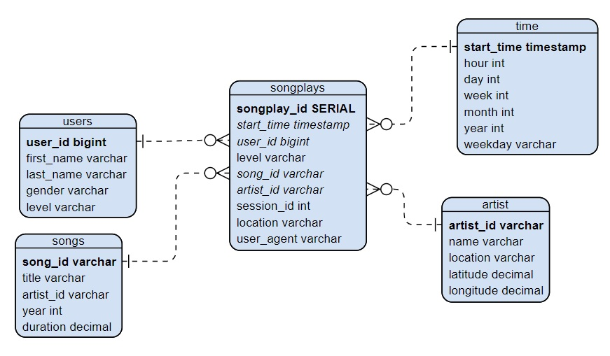

# Data Modeling with Postgres

## **Project description**
Application of data modelling using Postgres SQL and building an ETL pipeline using Python for a startup that wants to analyze the data collected on songs and user activities. The data collected are in json format divided into songs and logs datasets.

## **Song Dataset**
Comes from a subset of [Million Song Dataset](http://millionsongdataset.com/).

Sample Record :
```
{"num_songs": 1, "artist_id": "AR7SMBG1187B9B9066", "artist_latitude": null, "artist_longitude": null, "artist_location": "", "artist_name": "Los Manolos", "song_id": "SOBCOSW12A8C13D398", "title": "Rumba De Barcelona", "duration": 218.38322, "year": 0}
```

## **Log Dataset**
Generated by [Event Simulator](https://github.com/Interana/eventsim).

Sample Record :
```
{"artist":"Juan Carmona","auth":"Logged In","firstName":"Kate","gender":"F","itemInSession":90,"lastName":"Harrell","length":331.44118,"level":"paid","location":"Lansing-East Lansing, MI","method":"PUT","page":"NextSong","registration":1540472624796.0,"sessionId":293,"song":"Panales de Algodon","status":200,"ts":1541549367796,"userAgent":"\"Mozilla\/5.0 (X11; Linux x86_64) AppleWebKit\/537.36 (KHTML, like Gecko) Chrome\/37.0.2062.94 Safari\/537.36\"","userId":"97"}
```

## Schema

#### Fact Table 
**songplays** - records in log data associated with song plays i.e. records with page 

#### Dimension Tables
**users** - users in the app

**songs** - songs in music database

**artists** - artists in music database

**time** - timestamps of records in  **songplays**  broken down for further queries and visualization

### ERD



## Project Files

**create_tables.py** - Drops and creates tables.

**sql_queries.py** contains all your sql queries, and is imported into the last three files above.

**test.ipynb** - Displays the first few rows of each table for checking database before full implementation.

**etl.ipynb** - Reads and processes a single file from song_data and log_data and loads the data into your tables for testing before full implementation.

**etl.py** Reads and processes files from song_data and log_data and loads them into your tables. You can fill this out based on your work in the ETL notebook.


## How to run
1) Run the **create_tables.py** to create tables.
2) Run **test.ipynb** to ensure empty tables displayed correctly.
3) Run **etl.ipynb**  to ensure records are being inserted correctly.
4) Run **etl.py** to completion insertion of all records.

